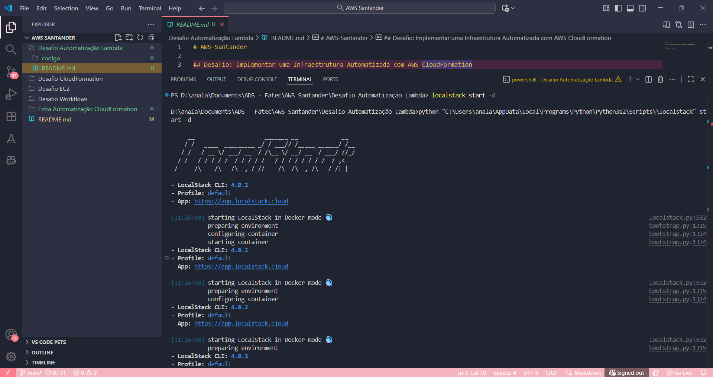
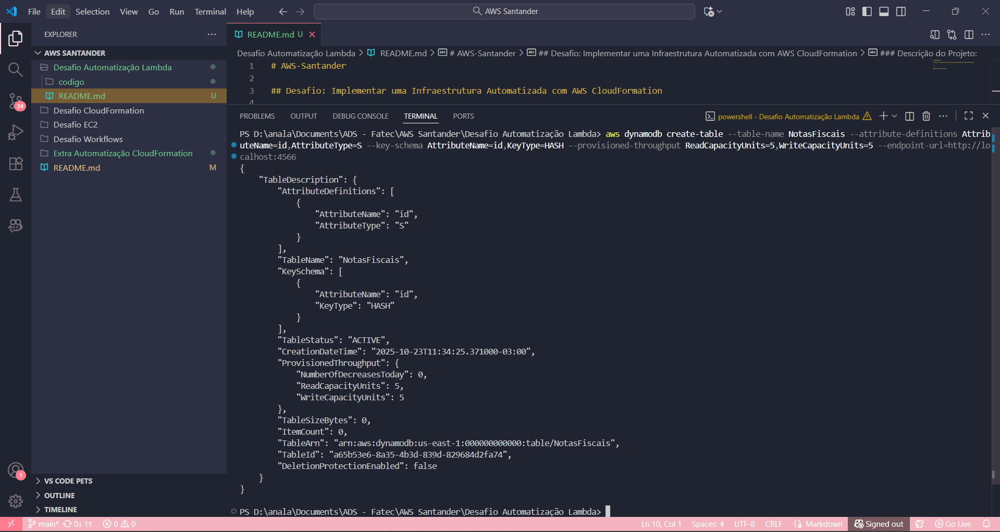

# AWS-Santander

## Desafio: Executando uma Infraestrutura Automatizada com AWS CloudFormation

> Executando uma infraestrutura automatizada com AWS CloudFormation e LocalStack, servindo como material de apoio para estudos e futuras implementações.

---

### Descrição do Projeto:

Este projeto, desenvolvido como parte do bootcamp AWS Santander Codegirls, demonstra a construção e o teste de um pipeline de processamento de dados 100% serverless. A solução foi inteiramente simulada em um ambiente de desenvolvimento local, utilizando LocalStack e Docker, para validar a arquitetura antes de qualquer deploy na nuvem AWS real.

O objetivo principal foi simular o recebimento de notas fiscais (arquivos) em um Bucket S3, que por sua vez aciona uma Função Lambda para processar esses dados e armazená-los em uma tabela estruturada no DynamoDB (a "tabela com notas fiscais").

### Destaque Técnico: Desenvolvimento Ágil com LocalStack

A decisão de usar o LocalStack foi estratégica para este desafio, permitindo um desenvolvimento ágil, seguro e econômico, simulando o ambiente AWS real:

Ambiente de Simulação Fiel: O LocalStack espelha as APIs da AWS. Isso permitiu que a criação do bucket S3, da tabela DynamoDB e da função Lambda fosse feita com os exatos mesmos comandos do `aws cli` que seriam usados em produção, apenas apontando para o endpoint local. (Veja a imagem: [criar_s3.png](./Desafio%20Automatização%20LocalStack/criar_s3.png))

Testes de Ponta-a-Ponta Sem Custo: A principal vantagem foi poder executar o ciclo de vida completo (upload -> processamento -> gravação) de forma ilimitada, sem gerar custos na nuvem. Isso cria um sandbox perfeito para validar a infraestrutura, as permissões e a lógica da função antes de um deploy final.

### A Lógica de Negócio (Função Lambda):

O "cérebro" desta automação é a função Lambda (escrita em Python). Ela atua como o worker serverless que executa a lógica de negócio principal assim que é acionada:

Recepção do Evento S3: A função é invocada automaticamente pelo S3. Ela recebe um pacote de dados (o "evento") e extrai dele as informações essenciais: o nome do bucket e o nome do arquivo (`.json`) que acabou de ser enviado.

Extração e Processamento do Arquivo: Utilizando o SDK Boto3, a função acessa o S3, lê o conteúdo do arquivo `.json` (a nota fiscal) e faz o parse (leitura/análise) dos dados.

Persistência no DynamoDB: Após extrair os dados relevantes da nota fiscal (como ID, cliente, valor, data de emissão, etc.), a função se conecta ao DynamoDB e insere um novo item na tabela `NotasFiscais` com essas informações, concluindo o fluxo de automação.

### Arquitetura e Fluxo de Execução:

1. Ambiente Local: O LocalStack foi executado em um contêiner Docker, provendo um mock (simulação) dos serviços da AWS (S3, Lambda, DynamoDB) localmente.

2. Provisionamento: O AWS CLI (configurado para apontar para o endpoint do LocalStack) foi usado para criar toda a infraestrutura:

- O Bucket S3 de entrada (`bucket-notas-fiscais`).

- A tabela NoSQL no DynamoDB (`tabela-notas-fiscais`).

- A função Lambda (com o código de processamento) e o trigger (gatilho) de eventos do S3.

3. Execução do Teste:

- Um arquivo de exemplo (ex: `notas_fiscais.json`) foi enviado para o Bucket S3 via AWS CLI (`aws s3 cp ...`).

- O S3 (LocalStack) detectou o evento `s3:ObjectCreated:*` e acionou automaticamente a função Lambda.

- A Lambda leu o arquivo, processou seu conteúdo e o inseriu como um novo item na tabela DynamoDB.

4. Validação: Para "exibir as notas fiscais" e provar que o projeto foi executado com sucesso, foi realizado um comando `aws dynamodb scan ...` contra a tabela. O retorno no terminal confirmou que os dados da nota fiscal foram processados e persistidos corretamente.

### Ferramentas e Tecnologias:

- **LocalStack:** Para simular o ambiente AWS localmente.
- **Docker:** Para executar o contêiner do LocalStack.
- **AWS CLI:** Para interagir com os serviços do LocalStack.
- **AWS S3:** Como repositório de objetos e para disparar eventos que iniciam outros processos.
- **AWS Lambda:** Para a execução de código serverless, sem a necessidade de gerenciar servidores.
- **AWS DynamoDB:** Como banco de dados NoSQL para armazenamento dos dados.
- **Python (Boto3):** Para o desenvolvimento da função Lambda.

### Passo a Passo da Implementação:

Todo o provisionamento da arquitetura foi executado via terminal no VSCode, utilizando o AWS CLI configurado para apontar manualmente para o endpoint do LocalStack, porém, também foi testado via PowerShell como demonstrado na aula, abaixo segue o passo a passo.

1. Logue e deixe o Docker aberto ou instale a extensão no VSCode.

  

#### 2. O segundo passo instalar a LocalStack (`pip install localstack`) e iniciar o contêiner do LocalStack em modo detached para que todos os serviços da AWS estivessem disponíveis localmente.

`localstack start -d`

   

#### 3. Criação da Tabela no DynamoDB
O próximo passo foi definir o banco de dados. Foi criada a tabela **NotasFiscais** no DynamoDB, estruturada para usar o atributo id como chave primária (`--key-schema AttributeName=id,KeyType=HASH`).

  

#### 4. Criação da Função Lambda
A função **ProcessarNotasFiscais** foi criada, empacotada em um arquivo .zip (`--zip-file fileb://function.zip`) e configurada com as variáveis (`--environment file://lambda-env.json`) de ambiente necessárias para se conectar à tabela do DynamoDB.

  

#### 5. Configuração das Permissões
Para finalizar o trigger, foi necessário autorizar o S3 a 'chamar' a função Lambda, o que foi feito adicionando uma permissão diretamente no Lambda.

  

#### 6. Teste e Validação

A etapa final de configuração foi aplicar a notificação de eventos ao S3, criando o gatilho. Para **validar** todo o pipeline, um arquivo .json de teste foi enviado ao bucket.

O sucesso da operação foi evidenciado pelo comando `aws dynamodb scan`. A tabela retornada (conforme print `teste2.png`) confirma que os dois registros do arquivo de teste foram processados pelo Lambda e gravados com sucesso no DynamoDB, atendendo a todos os requisitos do desafio.

Ao final de todos os testes, o ambiente LocalStack foi desligado para liberar os recursos da máquina local com o comando `localstack stop`.

   

  

### Conclusão:

A conclusão deste projeto valida habilidades essenciais em arquitetura de nuvem AWS. Fui capaz de provisionar, configurar e integrar três serviços distintos (S3, Lambda e DynamoDB) usando apenas o AWS CLI. O uso do LocalStack e Docker foi fundamental para criar um ambiente de desenvolvimento e testes local, seguro e sem custos, provando ser uma ferramenta indispensável para o ciclo de desenvolvimento serverless. O sucesso do teste de ingestão de dados demonstra o domínio sobre gatilhos, permissões (IAM) e a manipulação de dados entre serviços.
