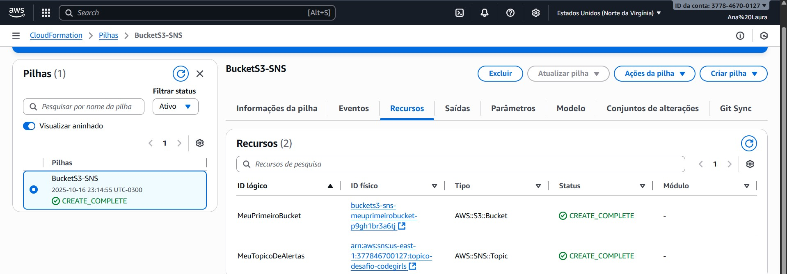

# AWS-Santander

## Desafio implementar minha primeira stack com AWS CloudFormation

> Implementar minha primeira stack com AWS CloudFormation, contendo anotações e insights adquiridos durante a prática, servindo como material de apoio para os seus estudos e futuras implementações.

É o serviço de Infraestrutura como Código (IaC) da AWS. Ele permite descrever e provisionar todos os recursos de sua infraestrutura (servidores, buckets, etc.) em um simples arquivo de texto chamado template. Ao enviar esse template em formato JSON ou YMAL, o CloudFormation automaticamente cria os recursos em uma unidade única chamada Stack, garantindo que sua infraestrutura seja automatizada, padronizada e gerenciável.

---

### Os 3 Conceitos-Chave:
**1. Templates (A Planta Baixa):**

- São arquivos de texto escritos em formato YAML ou JSON.

- É aqui que você declara os recursos que deseja criar (ex: uma instância EC2, um bucket S3, um banco de dados RDS).

- Você não diz como criar, apenas o que criar. O CloudFormation se encarrega do resto. O template é a sua "fonte da verdade" para a infraestrutura.

**2. Stacks (A Construção):**

- Uma Stack é o conjunto de recursos que o CloudFormation cria a partir de um template.

- Se o template é a planta, a stack é o "prédio" construído. Você pode criar, atualizar ou deletar uma stack inteira como se fosse uma única unidade.

- Isso torna o gerenciamento extremamente simples. Se você deletar a stack, o CloudFormation apaga todos os recursos que foram criados para ela, evitando recursos "órfãos" e cobranças inesperadas.

**3. Resources (Os Tijolos):**

- São os componentes individuais que você declara no seu template. Cada recurso corresponde a um serviço da AWS, como AWS::EC2::Instance (um servidor EC2) ou AWS::S3::Bucket (um bucket S3).

--- 

### Vantagens: 

1. Automação e Agilidade:

Em vez de gastar horas ou dias em configurações manuais, você provisiona ambientes complexos inteiros em minutos. Isso acelera drasticamente os ciclos de desenvolvimento, pois as equipes podem criar ambientes de teste idênticos sob demanda e executar recuperações de desastres de forma muito mais rápida e confiável.

2. Consistência e Padronização:

O template atua como a única "fonte da verdade", garantindo que os ambientes de desenvolvimento, teste e produção sejam réplicas exatas uns dos outros. Isso elimina o clássico problema do "mas funciona na minha máquina" e o desvio de configuração (quando ambientes que deveriam ser idênticos se tornam diferentes com o tempo).

3. Segurança e Redução de Riscos:

O serviço possui mecanismos que protegem seus ambientes contra falhas. Com os Change Sets, você prevê o impacto exato de uma mudança antes de aplicá-la. Se algo der errado durante uma atualização, o Rollback automático restaura o ambiente ao seu último estado funcional, protegendo a estabilidade do seu sistema.

4. Governança e Controle Total:

Como a infraestrutura é definida como código, ela pode ser versionada em um sistema como o Git. Isso cria um histórico completo de todas as alterações feitas: quem mudou, o que mudou e quando. Essa rastreabilidade é extremamente valiosa para auditorias de segurança, conformidade (compliance) e para depurar problemas.

5. Otimização de Custos:

A automação e o gerenciamento centralizado evitam o desperdício. Fica fácil criar ambientes temporários para testes e depois destruí-los completamente com um único comando, garantindo que você não deixe recursos ligados por engano. A padronização também ajuda a garantir que os recursos provisionados tenham o tamanho correto, sem excessos.

---

### Desafio de Implementação:

> A implementação foi dividida em duas fases estratégicas para garantir um aprendizado sólido e progressivo.

---

### Primeiro template: BucketS3

  

**O template continha apenas o essencial para funcionar:**

1. Resources: Nesta seção, declarei o recurso que eu queria criar: MeuPrimeiroBucket, do tipo AWS::S3::Bucket. Deixei o nome do bucket em branco para que o CloudFormation gerasse um nome único, uma prática que evita conflitos.

2. DeletionPolicy: Retain: Adicionei esta política como uma medida de segurança. Ela instrui o CloudFormation a não apagar o bucket caso a stack seja excluída, protegendo os dados contra uma exclusão acidental.

3. Outputs: Configurei esta seção para que, ao final da criação, o CloudFormation me informasse o nome exato do bucket criado, facilitando a verificação.

> Essa abordagem foi a decisão mais importante do projeto, pois me deu a confiança e o entendimento prático para depois evoluir para uma solução mais completa com S3 e SNS.

Para conferir o código YAML BucketS3 completo acesse o arquivo [clicando aqui.](bucketS3.yaml)

---

### Segundo template: BucketS3 + SNS

A solução final deste projeto utiliza dois serviços fundamentais da AWS que, quando combinados, criam uma arquitetura reativa e automatizada.

---

### Arquitetura da Solução:

Para este desafio, optei por criar uma stack que provisiona dois recursos essenciais da AWS:

1. AWS S3 Bucket: Um repositório seguro para armazenamento de objetos. O nome do bucket é gerado dinamicamente pelo CloudFormation para garantir que seja único e não depende de região, de chave, de imagem, de nada. É o recurso mais simples e seguro para começar.

2. AWS SNS Topic: Um tópico de notificação que serve como um canal de comunicação.

### Objetivo da Arquitetura:

A combinação destes dois serviços simula uma arquitetura orientada a eventos. A ideia é que, em uma aplicação real, o Tópico SNS poderia ser configurado para enviar um alerta automático (por e-mail ou SMS) toda vez que um novo arquivo fosse adicionado ao Bucket S3, informando outros sistemas ou administradores sobre a nova chegada. Isso demonstra o poder de automatizar processos na nuvem.

> A ideia é que, em uma aplicação real, o Tópico SNS poderia ser configurado para **enviar um alerta automático** (por e-mail, por exemplo) toda vez que um novo arquivo fosse adicionado ao Bucket S3.

### Fluxo da Arquitetura:

1. Upload: Um novo arquivo é salvo no MeuPrimeiroBucket.

2. Evento: O S3 detecta a criação do novo objeto e aciona uma notificação.

3. Publicação: O S3 envia uma mensagem para o MeuTopicoDeAlertas com detalhes sobre o novo arquivo (nome, tamanho, etc.).

4. Distribuição: O SNS encaminha essa mensagem para todos os "assinantes" do tópico (que poderiam ser um e-mail, uma mensagem de SMS, uma função Lambda para processar o arquivo, etc.).

  

  

Para conferir o código YAML BucketS3 + SNS completo acesse o arquivo [clicando aqui.](bucketS3eSNS.yaml)