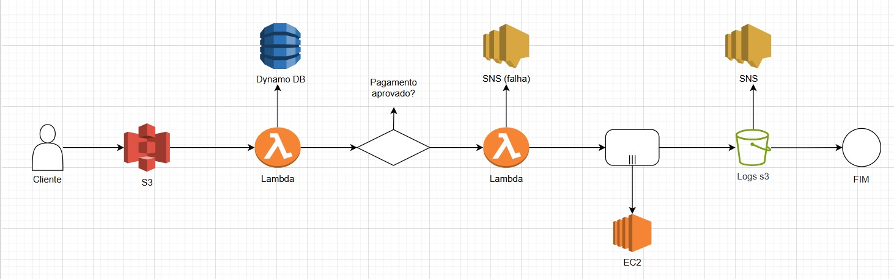
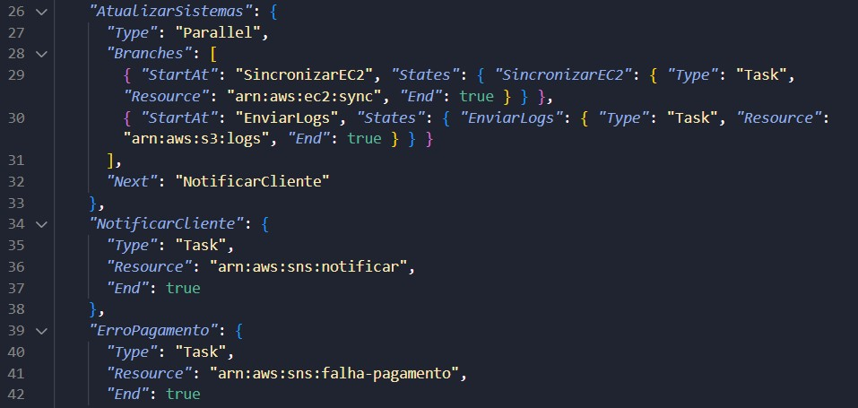

# AWS-Santander

## Desafio workflows automatizados com AWS Step Functions

> Consolidar seus workflows automatizados com AWS Step Functions, contendo anotações e insights adquiridos durante a prática.

O AWS Step Functions é um serviço que permite criar workflows automatizados e visuais para aplicações distribuídas.
Ele coordena diferentes serviços da AWS por meio de uma máquina de estados, definida em Amazon States Language (JSON), eliminando a necessidade de escrever lógica de orquestração manual.

### Principais Caracteristícas:

**Desenvolvimento Simplificado (Low-Code):** Permite construir aplicações complexas com pouca ou nenhuma codificação manual, agilizando o processo de desenvolvimento.

**Interface Visual Intuitiva:** O console do AWS Step Functions oferece um diagrama de fluxo que facilita a visualização, o monitoramento e a depuração da lógica da sua aplicação de ponta a ponta.

**Arquitetura Serverless:** Elimina a necessidade de gerenciar servidores. A AWS cuida de toda a infraestrutura, e a cobrança é feita apenas pela execução dos seus fluxos de trabalho.

**Aceleração do Desenvolvimento:** Reduz significativamente o código necessário para orquestrar as tarefas da sua aplicação, resultando em economia de tempo e recursos.

**Integração Profunda com a AWS:** Conecta-se de forma nativa a uma vasta gama de serviços da AWS, como Lambda, SQS, EC2, SNS e DynamoDB, simplificando a criação de fluxos de trabalho distribuídos.

Cada etapa é chamada de state, e pode executar ações (via Lambda, ECS, DynamoDB, etc.), fazer escolhas condicionais ou lidar com falhas automaticamente.

---

### Tecnologias e ferramentas:

- AWS Step Functions – Orquestração dos fluxos de trabalho;

- AWS Lambda – Execução de funções serverless para processamento;

- Amazon S3 – Armazenamento de arquivos (pedidos e logs);

- Amazon DynamoDB – Banco de dados NoSQL para salvar status dos pedidos;

- Amazon SNS – Serviço de notificação para confirmação e alertas;

- Amazon EC2 – Execução de processos auxiliares ou sistemas legados;

- Amazon CloudWatch – Monitoramento e logs;

- GitHub + Markdown – Documentação e versionamento do projeto.

---

### Estrutura e Conceitos Fundamentais

O Step Functions é construído com base em dois elementos principais:

- Máquinas de Estado (State Machines) — representam o fluxo completo de um processo, também conhecido como workflow.

- Estados (States) — cada passo dentro do fluxo é considerado um estado, definido por meio da Amazon States Language (ASL), uma linguagem baseada em JSON.

### Tipos de estados:

 **1- Estados de Fluxo (Flow States), controlam o comportamento e a sequência de execução das etapas:**

- Choice State → Define condições e caminhos diferentes no fluxo.

- Wait State → Pausa a execução por um tempo determinado.

- Map State → Executa fluxos de trabalho secundários para cada item de um conjunto de dados.

- Parallel State → Cria execuções paralelas independentes.

**2- Estados de Tarefa (Task States):**

Representam ações específicas realizadas por outros serviços AWS, como chamadas a funções Lambda, gravações no DynamoDB ou envios de mensagens via SNS.

---

### Exemplo de Funcionamento do AWS Step Functions

Imaginando um cenário prático envolvendo vários serviços da AWS conectados em sequência:

1. Uma função AWS Lambda é acionada para processar um determinado dado.

2. Um serviço de Machine Learning (ML) entra em ação para analisar esse dado processado.

3. Um serviço de notificação, como o Amazon SNS, é utilizado para enviar um e-mail com o resultado final.

O AWS Step Functions atua como o orquestrador desse fluxo. Ele define a ordem das etapas e as condições de execução — por exemplo:

> Primeiro, execute a função Lambda; se for concluída com sucesso, prossiga para o serviço de ML; e, por fim, envie uma notificação ao usuário.

Se alguma etapa falhar, o Step Functions pode repetir a tentativa automaticamente ou seguir um caminho alternativo de erro, conforme configurado.

---

## **Exemplo de projeto - Pedidos Online**

Este projeto simula o fluxo completo de processamento de pedidos em uma aplicação de e-commerce.

### O fluxo automatiza:

1. Recebimento do pedido do cliente;

2. Processamento e validação do pagamento;

3. Armazenamento dos dados no DynamoDB;

4. Envio de notificações automáticas via SNS;

5. Registro de logs e backups no S3.

### Fluxo detalhado:

Início (Trigger):
O processo é iniciado quando um novo pedido é enviado para um bucket do Amazon S3 (/orders/pending).

> Etapa 1 — Validação do Pedido (Task State)

Uma função Lambda é invocada para:

Ler o arquivo JSON do pedido no S3;

Validar informações obrigatórias (cliente, itens, valor, pagamento).

Se válido → prossegue.
Se inválido → direciona para o estado de erro.

> Etapa 2 — Processar Pagamento (Choice State)

Um Choice State decide o fluxo:

Se pagamentoAprovado = true → segue para a gravação no banco;

Caso contrário → envia notificação de falha via SNS e registra no CloudWatch.

> Etapa 3 — Registrar Pedido (Task State)

Uma Lambda grava os dados do pedido no Amazon DynamoDB.
Status do pedido atualizado: PROCESSADO.

>Etapa 4 — Atualizar Sistemas Legados (Parallel State)

Dois fluxos paralelos:

Branch 1: Executa uma instância EC2 que sincroniza o pedido com um sistema legado.

Branch 2: Envia logs de execução para o Amazon S3 (/orders/logs).

> Etapa 5 — Notificar Cliente (Task State)

Uma Lambda dispara uma notificação via Amazon SNS, confirmando o sucesso do pedido para o cliente.

> Etapa 6 — Caminho de Erro (Catch State)

Em caso de falha em qualquer etapa:

Envia log para o CloudWatch;

Dispara SNS para equipe de suporte;

Move o arquivo para /orders/error no S3.

> Etapa 7 — Encerramento (End State)

Ao concluir com sucesso, a execução é encerrada.
Todas as transições e logs ficam disponíveis no AWS Step Functions Console para auditoria.

  

### Benefícios e Considerações

- Automação total: o processo é 100% automatizado sem intervenção manual.

- Alta disponibilidade: utiliza serviços serverless com escalabilidade automática.

- Baixo custo: paga apenas pelo uso (transições de estado e execuções).

- Observabilidade: monitoramento e logs integrados via CloudWatch.

- Segurança: controle de acesso via IAM Roles e Security Groups.

### Exemplo de Definição Step Function (JSON)

  

Para conferir o código JSON completo acesse o arquivo [clicando aqui.](Pedidos_Online.json)

### Conclusâo:

Este projeto demonstra como a AWS Step Functions pode coordenar diversos serviços da AWS para automatizar o processamento de pedidos em uma arquitetura serverless, segura e escalável.
Servindo como base para soluções reais de e-commerce e pipelines empresariais.
