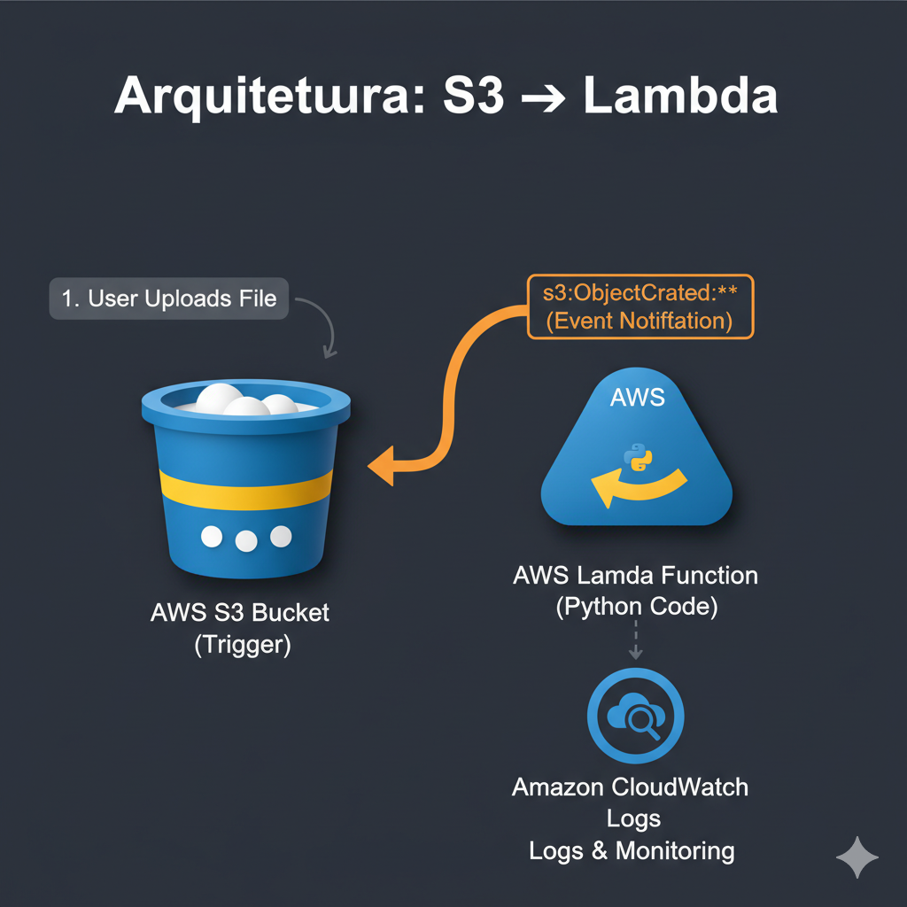
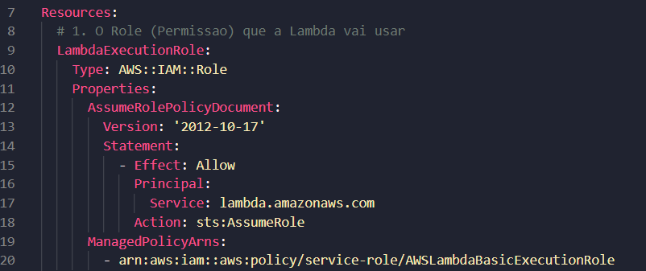
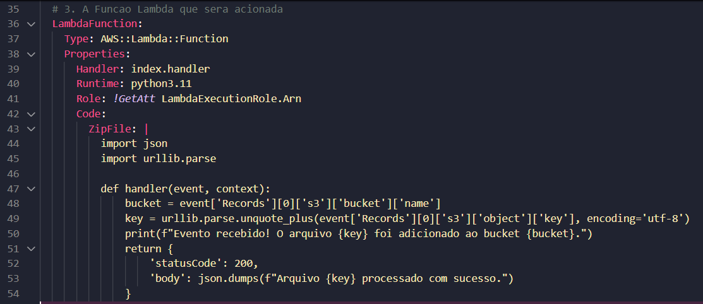
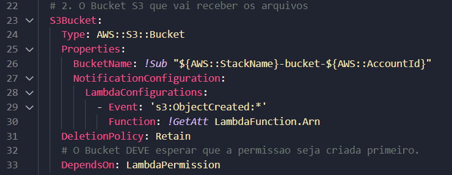
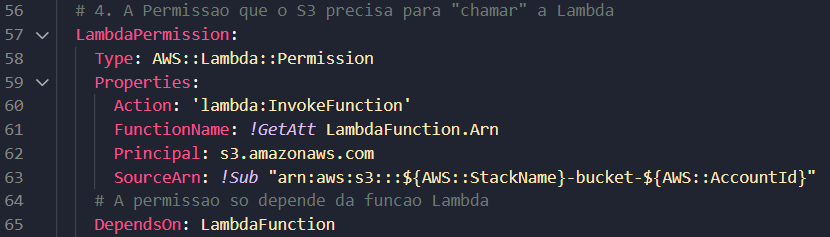
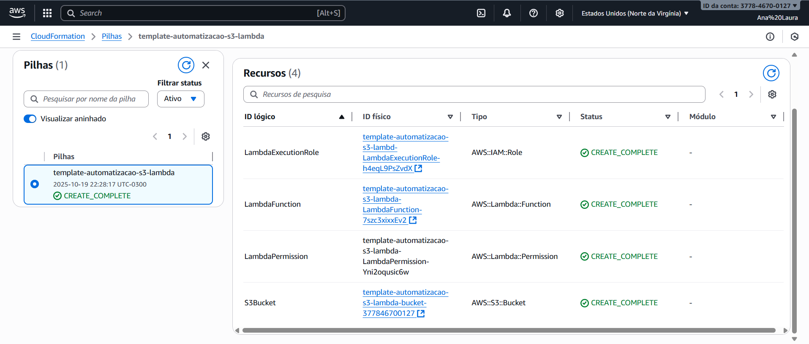
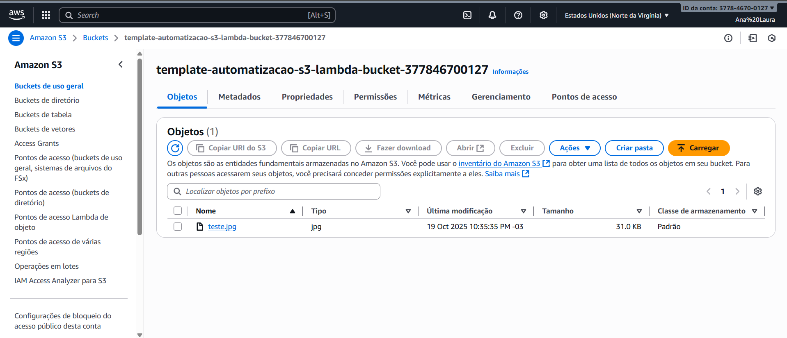
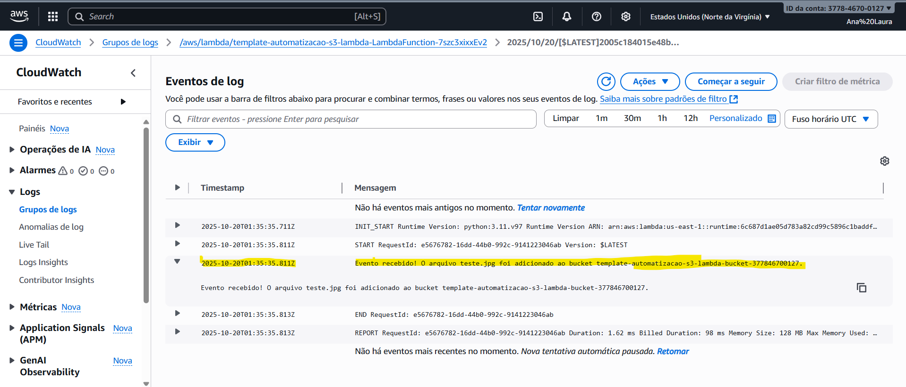

# AWS-Santander

## Extra: Implementar uma Infraestrutura Automatizada em Nuvem com AWS CloudFormation

> Implementar uma infraestrutura automatizada em nuvem com AWS CloudFormation, servindo como material de apoio para estudos e futuras implementações.

---

###  Descrição do Projeto:

Este projeto demonstra a criação de uma **infraestrutura automatizada e orientada a eventos**, utilizando o CloudFormation como ferramenta de Infraestrutura como Código (IaC).

A solução implementa um dos padrões de arquitetura mais comuns e fundamentais da nuvem: um fluxo de trabalho **S3 -> Lambda**. Um Bucket S3 é configurado para, ao receber um novo arquivo, acionar automaticamente uma função Lambda para processamento. O CloudFormation é responsável por provisionar não apenas os recursos, mas também as permissões e a "cola" (configuração de evento) que os conectam.

---

### Arquitetura da Solução:

O template do CloudFormation provisiona e conecta todos os 4 recursos a seguir para criar um fluxo de dados coeso:

1.  **AWS S3 Bucket:** Serviu como a fonte de eventos (event source) da arquitetura. Sua configuração de notificação (NotificationConfiguration) foi usada como o gatilho (trigger) que, ao detectar um evento s3:ObjectCreated:*, inicia todo o fluxo de trabalho automatizado.
- É um serviço de armazenamento de objetos de alta durabilidade, disponibilidade e escalabilidade. Os dados são armazenados em buckets com nomes globalmente únicos.
2.  **AWS Lambda Function:** Foi o alvo da automação (event target). A função (em Python) conteve a lógica de negócio principal: receber o evento do S3, parsear seus dados (nome do bucket e do arquivo) e executar a ação de processamento (registrar o log).
- É um serviço de computação serverless (sem servidor) orientado a eventos. Ele executa código em resposta a gatilhos, abstraindo completamente o gerenciamento da infraestrutura subjacente (servidores, sistema operacional, etc.).
3.  **AWS IAM Role:** Atuou como o mecanismo de autorização que "colou" os serviços. Foram criados dois tipos de permissão:

- 1. IAM::Role (Política de Identidade): Deu à Lambda uma identidade de execução com permissão para escrever logs no CloudWatch.

- 2. Lambda::Permission (Política de Recurso): Concedeu ao serviço S3 a permissão explícita para invocar a função Lambda.
- É o serviço que gerencia o controle de acesso granular na AWS. Ele opera com base em políticas JSON que definem "Quem" (Principal) pode realizar "Quais Ações" (Action) em "Quais Recursos" (Resource).
4.  **Amazon CloudWatch:** Serviu como a ferramenta de verificação e depuração. O CloudWatch Logs foi o destino final dos print() da nossa função Lambda, fornecendo a evidência (prova) de que o gatilho do S3 foi recebido e a automação executada com sucesso.
- É a plataforma nativa de monitoramento e observabilidade da AWS. Ela coleta e armazena logs, métricas e eventos de todos os serviços.

---

### Fluxo do Processo:

O fluxo de automação é simples e poderoso:

1.  **Upload:** Um usuário (ou sistema) faz o upload de um arquivo (ex: `imagem.png`) para o Bucket S3.
2.  **Trigger (Evento):** O S3 detecta o evento `s3:ObjectCreated:*` e aciona automaticamente a função Lambda, enviando os dados do evento.
3.  **Execução:** A função Lambda é executada, extrai o nome do bucket e o nome do arquivo do evento e imprime uma mensagem de log no CloudWatch.
4.  **Log:** Um novo registro de log é criado no CloudWatch, confirmando que o processo foi executado (ex: "Evento recebido! O arquivo imagem.png foi adicionado...").

  

  Imagem gerada pelo Gemini

---

### Tecnologias Utilizadas:

---

### Jornada de Desenvolvimento e Depuração:

**1. Criação das Permissões (IAM Role):**
O primeiro recurso definido é a `LambdaExecutionRole`. Esta é a política de identidade que a função Lambda "veste" para obter permissão de execução e para escrever logs no CloudWatch.

  

**2. Criação da Lógica (Lambda Function):**
Em seguida, a `LambdaFunction` é definida. Ela utiliza a `Role` criada no passo anterior e contém o código Python embutido que será executado.

  

**3. Definição do Nome do Bucket:**
Um desafio comum ao conectar S3 e Lambda é a "dependência circular". Para evitar isso, foi usada uma **decisão de design**: em vez de um nome aleatório, o nome do `S3Bucket` foi predefinido dinamicamente usando `!Sub "${AWS::StackName}-bucket-${AWS::AccountId}"`. Isso torna o nome do bucket único e, o mais importante, *previsível*.

  

**4. Criação da Permissão de Invocação (Lambda Permission):**
Com a Lambda criada e o nome do bucket já conhecido, a `LambdaPermission` é definida.
* Ela usa o nome previsível do bucket no `SourceArn`, quebrando o ciclo de dependência.
* Ela também usa um `DependsOn: LambdaFunction` para garantir que a Lambda exista antes que a permissão seja criada.

  

**5. Criação do Bucket e da Notificação:**
Finalmente, o `S3Bucket` é definido.
* Ele contém a `NotificationConfiguration` que aponta para a Lambda.
* Ele usa um `DependsOn: LambdaPermission` explícito. Isso força o CloudFormation a seguir a ordem correta: **Lambda -> Permissão -> Bucket**. Essa é a garantia final de que, quando o CloudFormation tentar criar o bucket, a permissão da qual ele depende já estará pronta e validada.

**Para conferir o código YAML completo acesse o arquivo [clicando aqui.](template-automatizacao-s3-lambda.yaml)**

---

### 6. Como Testar o Projeto (Resultados)

A automação foi validada seguindo estes passos:

1. Deploy: A Stack foi criada com sucesso no CloudFormation (`CREATE_COMPLETE`).

  

2. Upload: Foi feito o upload de um arquivo (`teste.jpg`) no bucket S3 criado (cujo nome foi obtido na aba "Saídas" da stack).

  

3. Confirmação: A execução foi verificada no console do **CloudWatch Logs**. O log da função Lambda apareceu imediatamente, contendo a mensagem "Evento recebido! O arquivo teste.jpg foi...", provando que a automação S3 -> Lambda foi executada com sucesso.

  

