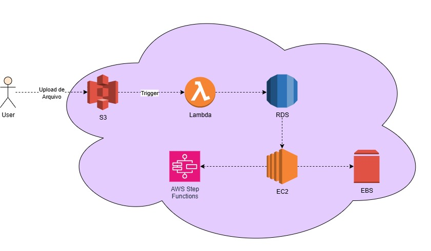

# AWS-Santander

## Desafio Instâncias EC2

> Consolidar seus conhecimentos em gerenciamento de instâncias EC2 na AWS

O Amazon EC2 (Elastic Compute Cloud) é um serviço da **AWS (Amazon Web Services)** que disponibiliza servidores virtuais sob demanda, chamados de instâncias. Essas instâncias permitem rodar aplicações, hospedar sites, processar grandes volumes de dados e até treinar modelos de machine learning. Elas podem ser configuradas conforme a necessidade do projeto, escolhendo sistema operacional, quantidade de CPU, memória, armazenamento e rede. A cobrança é feita de acordo com o uso, o que garante flexibilidade e custo-eficiência. Além disso, o EC2 oferece diferentes tipos de instâncias, otimizadas para computação, memória, armazenamento ou uso de GPU. É amplamente utilizado em ambientes corporativos por sua escalabilidade, segurança e integração com outros serviços da **AWS**.

---

A imagem representa uma arquitetura em nuvem utilizando serviços da **AWS** para processamento e armazenamento de dados. O usuário envia arquivos para o Amazon S3, que aciona automaticamente uma função Lambda para processamento inicial. Os dados processados podem ser armazenados no banco de dados relacional (RDS) e orquestrados por Step Functions, que coordenam tarefas adicionais em instâncias EC2. O EC2 utiliza volumes EBS para armazenamento persistente, garantindo desempenho e segurança na manipulação de informações.

### Fluxo da Arquitetura

1. O usuário faz upload de um arquivo para o Amazon S3.

2. O S3 gera um evento (trigger) que aciona a AWS Lambda.

3. A Lambda processa o arquivo ou os metadados e salva informações no Amazon RDS.

4. Dependendo da lógica, a Lambda ou o RDS podem acionar o fluxo do AWS Step Functions.

5. O Step Functions coordena tarefas no EC2 (ex.: processar os dados em lote, rodar scripts pesados).

6. O EC2 usa o EBS como armazenamento persistente para os dados processados.

7. Resultados podem ser gravados de volta no RDS ou no S3, dependendo do caso.

---

### Componentes da Arquitetura

**1. User (Usuário)**

- Pessoa ou sistema que realiza o upload de um arquivo.

**2. Amazon S3 (Simple Storage Service)**

- Serviço de armazenamento de objetos.

- O usuário faz upload do arquivo aqui.

- Esse upload gera um evento (trigger).

**3. AWS Lambda**

- Função serverless que é acionada automaticamente pelo trigger do S3.

- Pode processar o arquivo, validar, transformar dados etc.

- Após o processamento, pode armazenar ou manipular dados no banco.

**4. Amazon RDS (Relational Database Service)**

- Base relacional utilizada para armazenamento estruturado dos dados processados.

- A Lambda grava/consulta dados aqui (ex: metadados do arquivo, resultados de processamento).

**5. Amazon EC2 (Elastic Compute Cloud)**

- Máquina virtual na nuvem.

- Usada para processamentos mais pesados ou aplicações que precisam rodar continuamente.

- Pode se comunicar com o RDS e acessar armazenamento adicional.

**6. Amazon EBS (Elastic Block Store)**

- Volume de armazenamento em bloco anexado ao EC2.

- Guarda dados persistentes ou arquivos grandes.

**7. AWS Step Functions**

- Serviço de orquestração de fluxos.

- Coordena a execução de múltiplos serviços da AWS (como Lambda e EC2).

- Garante que as etapas sejam executadas na ordem certa e com tolerância a falhas.

---

### Benefícios da Arquitetura

Escalabilidade: uso de Lambda para workloads event-driven.

Segurança: integração com VPC, roles e policies do IAM.

Custo-eficiência: execução sob demanda, com instâncias EC2 apenas para tarefas pesadas.

Confiabilidade: Step Functions garante controle de fluxo e retries automáticos.

